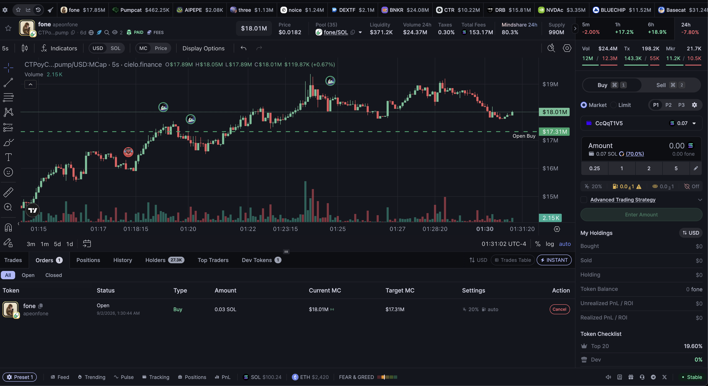
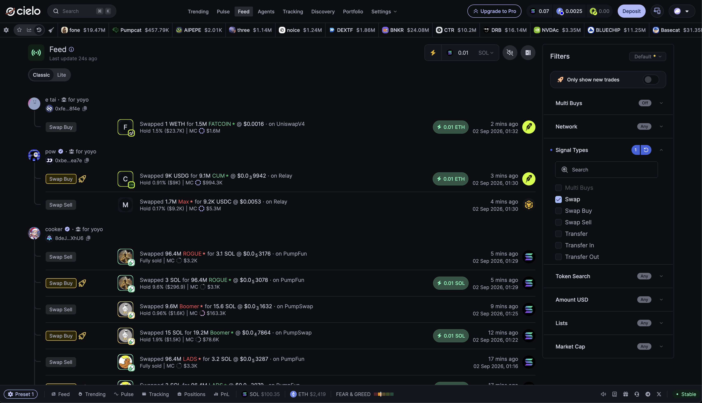
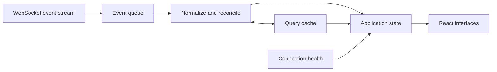
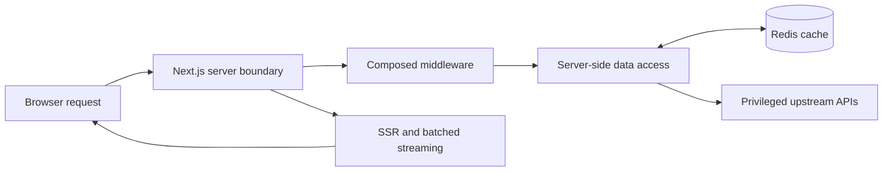
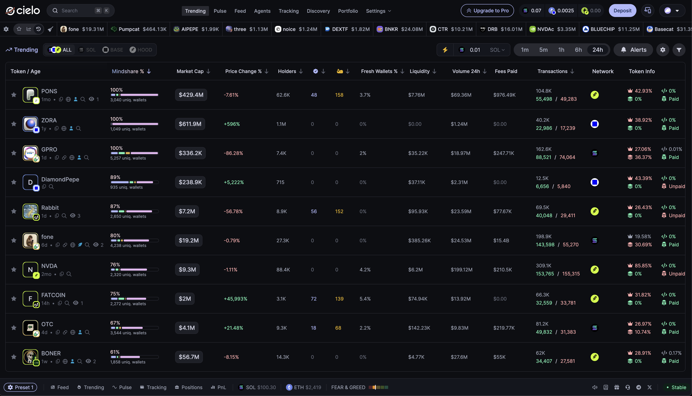
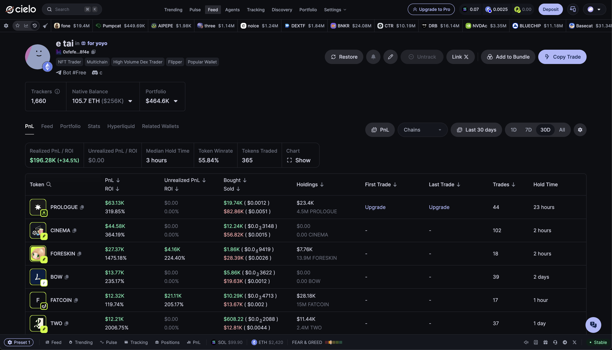
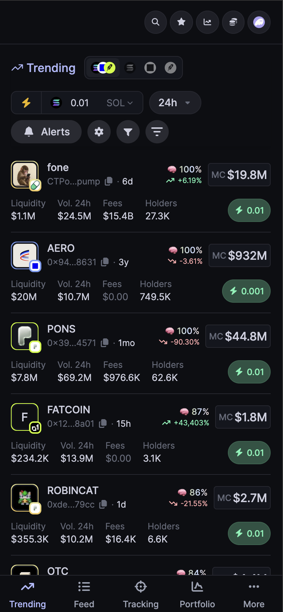
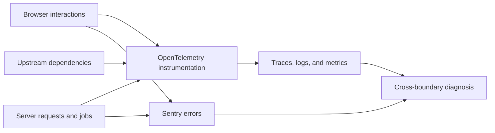

# Cielo Finance

### Real-time onchain analytics & trading

**Senior Software Engineer · March 2025–present**

[View the live product](https://cielo.finance/)

Cielo is a data-intensive crypto analytics platform for tracking onchain activity, analyzing wallets, and acting on that information through integrated trading tools.

I work across the product stack, with a particular focus on **real-time interfaces, frontend architecture, data infrastructure, trading UX, performance, and observability**.

## Real-time trading terminal

I helped build and ship a trading terminal that brings interactive TradingView charts, live trade overlays, wallet and market information, and swap and order execution into a single workspace.

The interface reconciles several forms of state at once:

- historical, query-backed data
- continuously arriving live events
- local interaction state
- wallet and trading state
- rapidly invalidating market data

The engineering challenge was not simply displaying a stream. It was keeping a high-frequency application predictable and responsive while its underlying data changed from several directions.

## Real-time client architecture

I built the client-side data layer that connects WebSocket subscriptions to product interfaces. It handles event queuing and buffering, connection health, query and cache invalidation, and reconciliation between live events and query-backed state.

This layer sits between the raw event stream and the React application, turning a continuously changing network feed into state the product can reliably consume.

_Conceptual data flow; this is not a representation of Cielo's proprietary internal architecture._

## Server-side data architecture

I rebuilt significant parts of the data-fetching layer around server-side rendering, batched streaming, Redis caching, and composable middleware. This work improved how quickly and consistently interfaces could receive data while creating a clearer place to control request behavior.

It also strengthened the application boundary: privileged upstream access and previously browser-exposed API credentials moved behind controlled server infrastructure.

_Conceptual request path, simplified to describe the engineering boundary rather than proprietary implementation details._

## Product breadth

The same data and interaction constraints appear across Cielo's product: dense market discovery views, wallet analytics, portfolio information, and trading workflows. My work spans the shared frontend and data infrastructure behind these kinds of interfaces; the screenshots below show product breadth rather than claiming sole ownership of each feature.

  
  

## Responsive, data-dense interfaces

On smaller screens, dense market information cannot simply be squeezed into a narrower table. Priority, grouping, navigation, and trading actions have to be recomposed for touch while retaining the context needed to make decisions.

  

## Observability across boundaries

I implemented client- and server-side observability using OpenTelemetry and Sentry. Traces, logs, metrics, and errors were designed to make failures diagnosable across browser, server, and upstream boundaries rather than leaving each layer as an isolated source of symptoms.

## Selected engineering problems

- **Live and cached state coherence.** Define how events enter the application, when cached queries become stale, and which source wins during reconciliation.
- **Failure as application state.** Surface connection health and reconnection behavior explicitly so a stale feed does not look authoritative.
- **High-density rendering.** Keep frequently updating interfaces responsive without sacrificing the context traders depend on.
- **End-to-end diagnosis.** Carry enough context across browser, server, and upstream boundaries to locate failures rather than only observe their final symptom.

## Stack

TypeScript · React · Next.js · tRPC · WebSockets · Redis · TradingView · OpenTelemetry · Sentry

## About this case study

Cielo's application and source code are proprietary; no company source code is included here. The screenshots, conceptual diagrams, and descriptions document publicly visible product work and the engineering areas I personally worked on. They do not disclose Cielo's internal implementation.

---

[Back to profile](../README.md)
