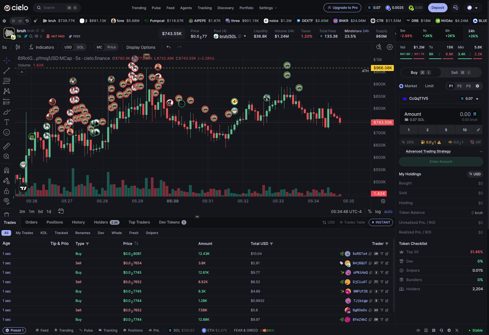
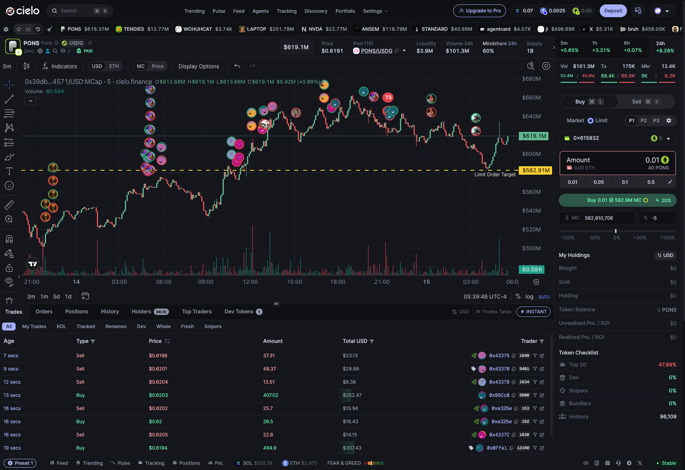

# Cielo Finance

### Keeping historical data, live trades, and chart interactions in sync

**Senior Software Engineer · March 2025–August 2026**

**Scope:** Solana trading terminal, real-time client architecture, server-side data access, and observability

[View the live product](https://cielo.finance/)

Cielo combines onchain wallet analytics with trading tools. I built the terminal’s TradingView datafeed and chart-state integration, the shared real-time client layer, the tRPC data-access layer, and browser/server observability.

I worked with a frontend technical lead and a UI-focused engineer, with shared QA support. The application already had an established foundation; we shipped the terminal together, with my work concentrated on how data and user actions move through it.

*Chart markers and the Trades table present activity from the shared live-data layer.*

## Joining historical candles to live swaps

The chart starts with historical OHLCV data—open, high, low, close, and volume—but builds its live candles from individual swaps. The same swap stream also feeds the trade list and other consumers. A chart can therefore attach after another component has already started receiving events, while its historical snapshot is still loading.

I built the handoff between those sources. The historical response seeds the candle accumulator; a supplied stream cursor identifies swaps already included in the snapshot. Recent events retained by the shared subscription provider can then be replayed to a later consumer. The accumulator orders incoming swaps, excludes events covered by the snapshot cursor, and updates candles for the selected interval and display mode.

Replay alone is not always enough. When the chart cannot establish coverage between its snapshot and live events, it buffers incoming swaps and fetches a bounded set of recent trades over HTTP. It merges and deduplicates those events before continuing. If coverage remains insufficient, it requests a fresh chart load.

That choice also shapes recovery after a backgrounded tab returns: catch up over completed candles for a shorter interruption, or reload after a long absence. Using completed candles avoids combining a partial historical candle with live accumulation for the same interval.

## One stream, different update policies

Centrifugo and its JavaScript client supply the transport and subscription recovery signals. I built the application layer above them: shared consumers, event queues, replay, connection health, query-cache updates, and recovery callbacks.

The update policy depends on what the interface needs:

- **Scalar values**, such as suggested transaction fees, can coalesce to the latest value instead of rendering every intermediate update.
- **Trade lists** batch events, merge them by identity, and keep the displayed rows ordered. Pausing the list buffers updates until the user resumes.
- **Hidden tabs** retain bounded buffers. On return, the application applies recent events and refreshes the query when elapsed time or overflow makes the retained data insufficient.

These policies keep buffering finite while giving the application an explicit path back to a current snapshot. For a swap subscription that cannot recover, that path refetches the current query data and resubscribes from its stream position when available.

## Keeping chart drawings consistent with product state

TradingView maintains its own widget state. I built the integration that keeps order targets and trade overlays aligned with application state across price/market-cap and USD/SOL display modes.

For limit orders, the form owns the target and the chart reflects it. I kept the line read-only on the chart because dragging it across widget scale modes could produce an incorrect target value. The shared target state preserves the user’s reference point as live market values change.

Trade markers need similar care when filters change. The integration tracks overlay revisions and marker identities, explicitly clearing removed marks before refreshing the chart so that old selections do not remain visible.

*The form’s target is reflected by the yellow chart line. This current-product capture shows an ETH-denominated market; my contribution described here covered the Solana terminal.*

## Streaming responses without losing session renewal

I built server-side data access around Next.js and tRPC, including server-prefetched queries, Redis caching, and reusable procedure middleware for tracing, caching, and access checks. Authenticated upstream requests run behind the server boundary, keeping upstream credentials server-side.

For query batches, tRPC streaming lets individual results reach the client as they complete. Session renewal introduces a constraint: once a streaming response starts, its headers cannot be changed to persist a renewed session cookie.

I made transport selection aware of session expiry. Queries normally use batch streaming, then switch to ordinary batching near renewal so the response can carry updated session headers. On the server, shared cached refresh results and locking coordinate concurrent requests to limit duplicate renewals, with bounded waiting and fallback paths.

This delivered server-prefetched data, cached responses, and incremental batch delivery. There was no comparable before/after performance baseline, so I do not attach a measured speedup to the work.

## Instrumenting the boundaries

I implemented OpenTelemetry traces, logs, and metrics in SigNoz, alongside Sentry error tracking. Custom instrumentation links server rendering to browser hydration and covers tRPC procedures, session renewal, Redis operations, and live-update processing.

The recovery paths record context such as replay coverage, catch-up progress, and fallback reasons. Sampling and batching control telemetry volume in the high-frequency client. This gives the application a shared diagnostic trail across its browser and server layers; backend services did not yet share a unified observability system during my tenure.

## Stack

TypeScript · React · Next.js · tRPC · TanStack Query · Centrifugo / Centrifuge.js · Redis · TradingView · OpenTelemetry · SigNoz · Sentry

---

*Cielo’s source is proprietary. This case study describes my contribution at the application level; no company source code is included. My terminal work covered Solana during the dates above.*

[Back to profile](../README.md)
