# Joust

### Social prediction markets for small communities

**Co-founder & Full-stack Product Engineer · 2025–present**

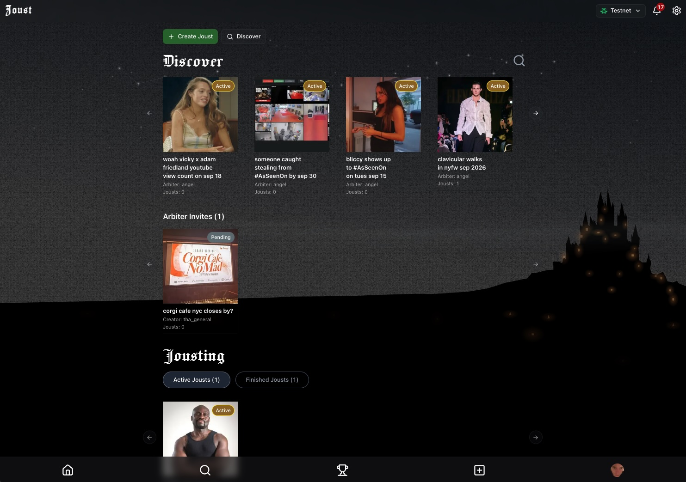

Joust is a social prediction-market product where people create pools, invite friends, stake on possible outcomes, and entrust settlement to an arbiter.

I built the product full-stack, from the interaction model and responsive interfaces to the database, wallet integration, onchain event handling, and background workflows that turn a transaction into reliable product state.

_Screenshots show the application running with testnet data._

## A market is more than a yes-or-no question

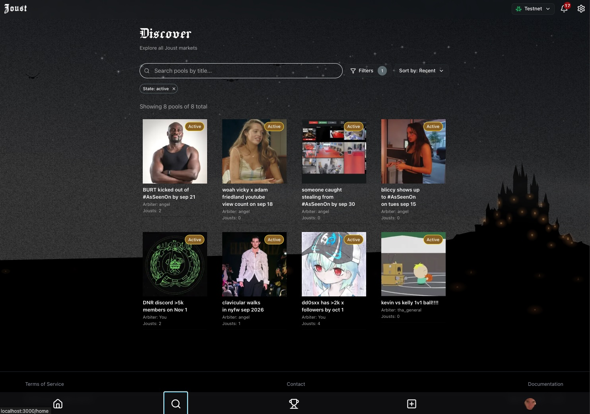

Pools can represent binary questions or a larger set of outcomes. Each one has a creator, a designated arbiter, a closing time, a minimum stake, collateral terms, and an explicit set of ordered options.

Discovery, invitations, participation, arbitration, and finished results are distinct product surfaces, but they share one underlying market model. The home experience brings those roles together without flattening them into a generic activity feed.

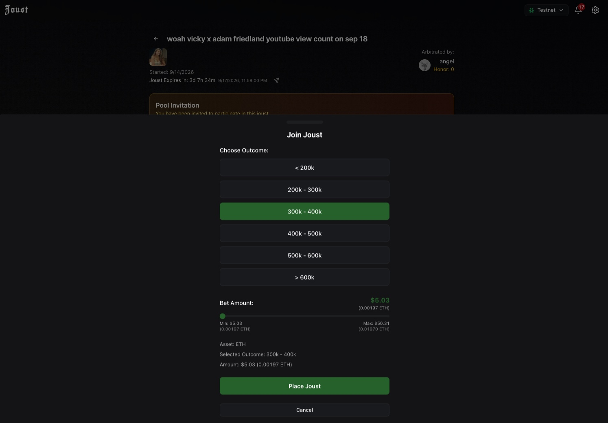

The entry flow turns contract constraints into a legible product interaction: choose an outcome, set an amount within the allowed range, understand the token value, and then hand off to the wallet. Multi-option pools use the same system as yes-or-no markets rather than a separate implementation.

## An explicit lifecycle for every pool

Creating a pool does not make it immediately active when another person has been chosen to arbitrate it. Joust models that responsibility as a first-class acceptance step, with the proposed arbiter shown the creator, fee, collateral, expiry, minimum entry, and settlement obligations before the pool opens.

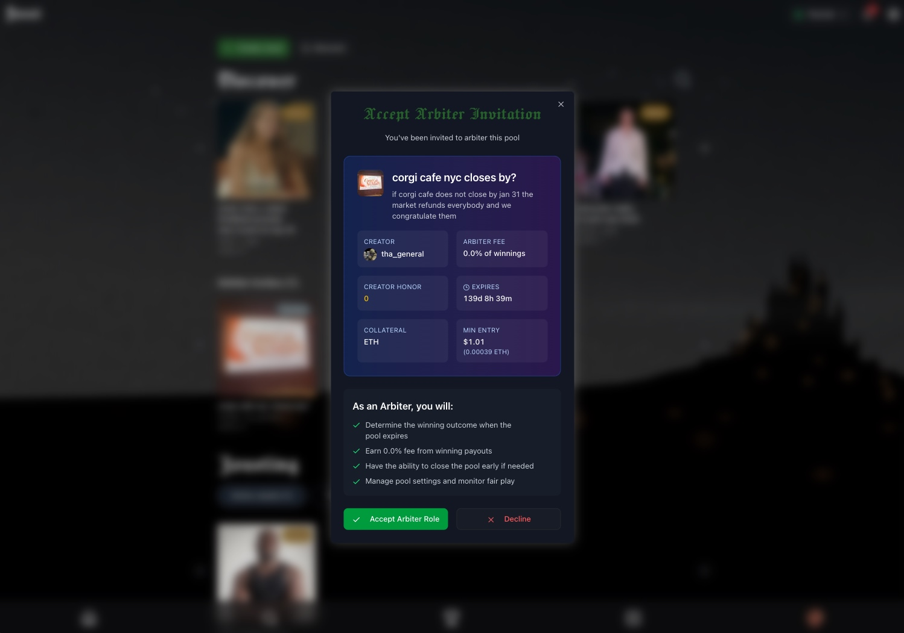

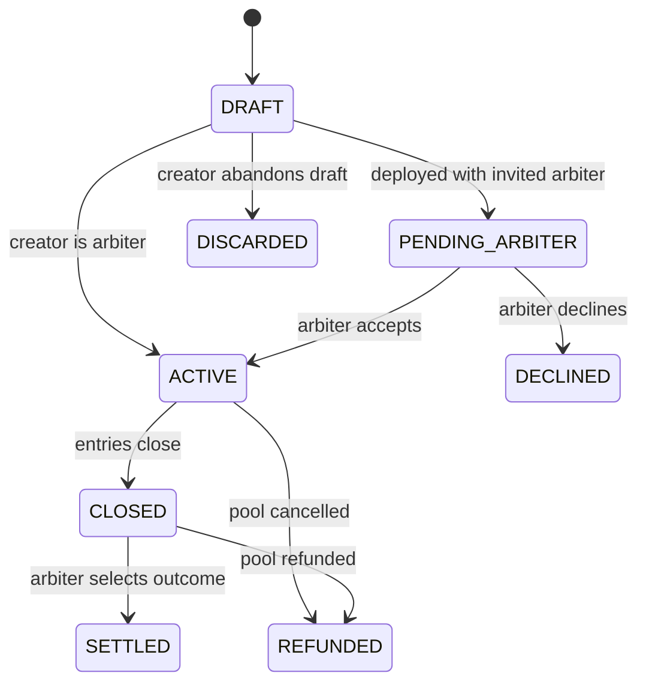

The same lifecycle drives visibility, permissions, available actions, notifications, and downstream accounting. Keeping it explicit makes invalid transitions harder to represent in both the interface and the persistence layer.

  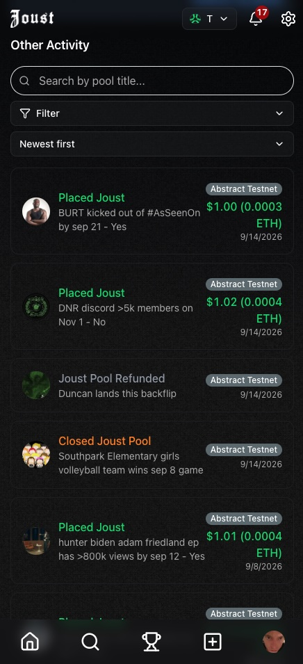&nbsp;&nbsp;
  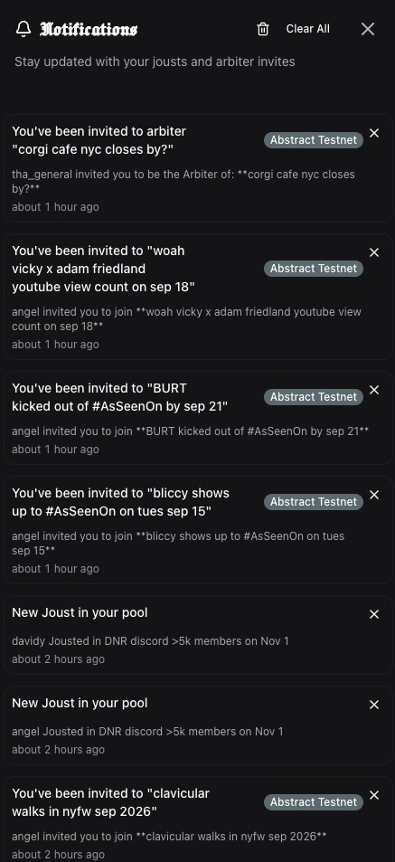&nbsp;&nbsp;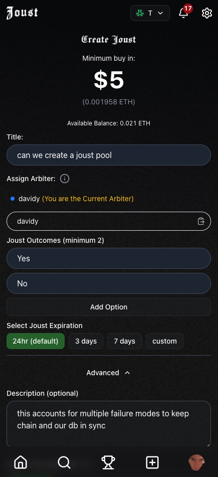

## Reliable onchain actions

A wallet confirmation is not the same thing as an application write. The browser can close, the RPC can fail, a transaction can revert, and a malicious or stale client can claim that the chain did something it did not.

I built a shared transaction-intent system for every onchain action: creating a pool, entering a joust, accepting arbitration, closing, settling, and refunding.

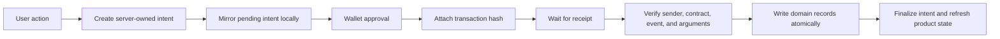

The server owns the metadata before the wallet opens. After submission, a durable background function retrieves the receipt and verifies its sender, destination, decoded event, pool, option, and amount against the original intent. Only then does it write the corresponding market, event, and fund-movement records.

The flow is designed for interruption:

- the transaction hash is persisted locally before it is attached to the server
- pending actions resume after refresh or a browser crash
- attachment retries are safe and idempotent
- chain events are unique by chain, transaction hash, and log index
- mismatched or reverted receipts fail without mutating domain state
- unrecoverable submissions are marked for operational review instead of remaining silently pending

This centralizes wallet-specific code and gives every onchain interaction the same recovery, error reporting, cache invalidation, and user feedback.

## Settlement as a durable workflow

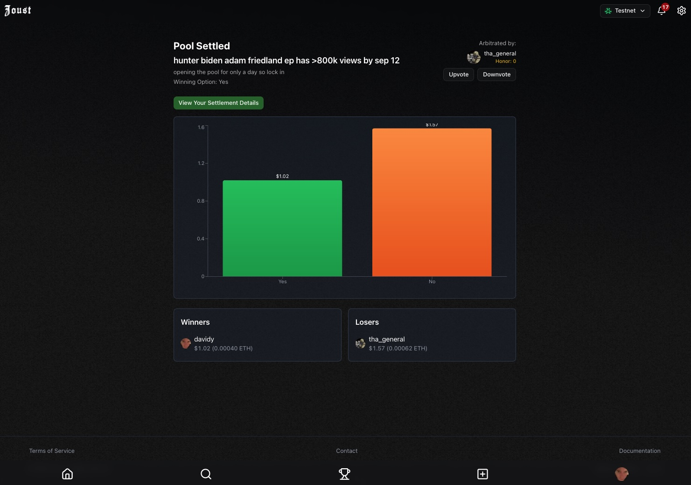

Settlement begins with one verified onchain result, then expands into several dependent pieces of product state. Joust reads the contract settlement summary once and fans the work out into retryable jobs for participant outcomes, fee movements, per-user summaries, and notifications.

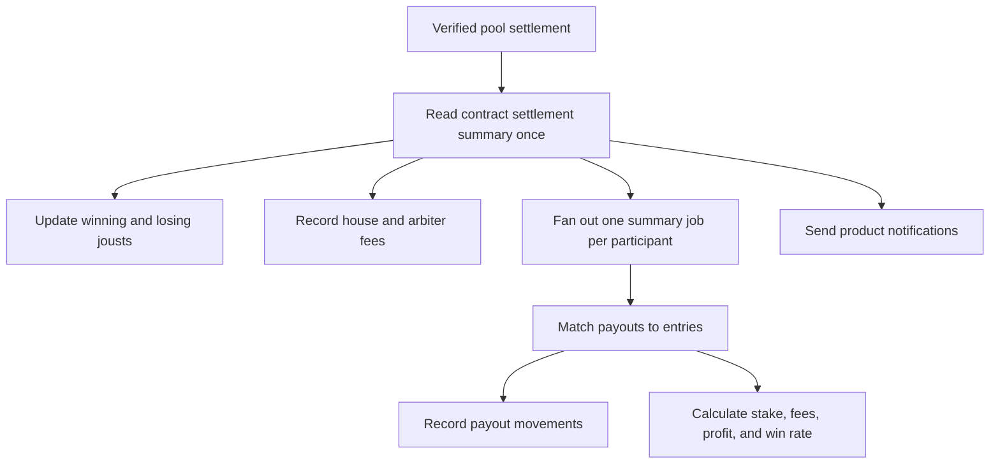

Each participant receives a persisted pool summary and per-entry breakdown, including stakes, gross and net payouts, fees, wins and losses, and profit in both token units and approximate USD value. Refunds follow a parallel workflow, producing an auditable record rather than being treated as a special-case reset.

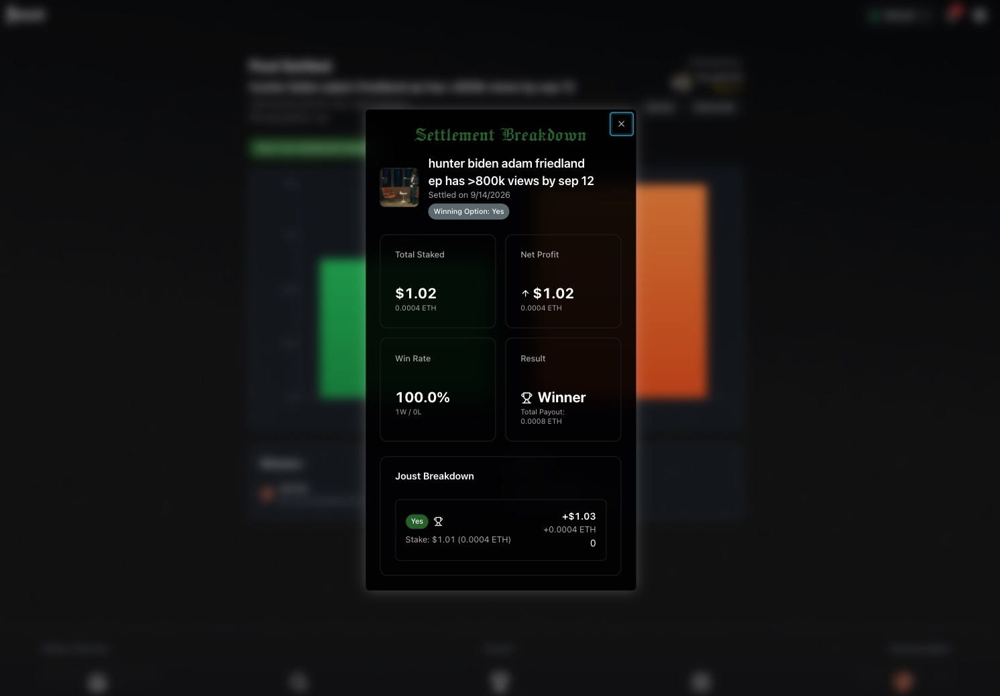

The user-facing result is concise, but it is backed by event provenance and explicit fund movements for deposits, payouts, refunds, house fees, and arbiter fees.

## Fast interfaces over shared data

The application combines Next.js server rendering with TanStack Query. Server components prefetch discovery, invitations, participant pools, and arbitration pools in parallel, then dehydrate the shared query cache for the interactive client. Query keys and query functions are shared across server and browser boundaries so the first render and subsequent refreshes describe the same data.

This matters on a home screen where a person can simultaneously be a participant, creator, invited arbiter, and active arbiter. The page can arrive populated while still supporting live filtering, pagination, and precise invalidation after an onchain action completes.

## A product world, not just a transaction interface

Joust uses a responsive, animated castle atmosphere to give the product a recognizable world without interfering with the market UI. The scene is built from layered PixiJS systems—stars, lights, fog, birds, bats, figures, and occasional ambient events—and includes a reduced-motion path.

That visual system sits behind ordinary React interfaces rather than dictating them. The product stays readable and operational while retaining a tone appropriate to jousts, arbiters, and competition.

## Stack

TypeScript · React · Next.js · TanStack Query · Prisma · PostgreSQL · Inngest · wagmi · viem · Abstract Wallet · Redis · PixiJS · Sentry

## About this case study

Joust is an independent product I co-founded and built. This case study documents my own product and engineering work using local testnet screenshots and conceptual diagrams derived from the application architecture. Wallet credentials, production data, deployment configuration, and contract source are not included.

---

[Back to profile](../README.md)
