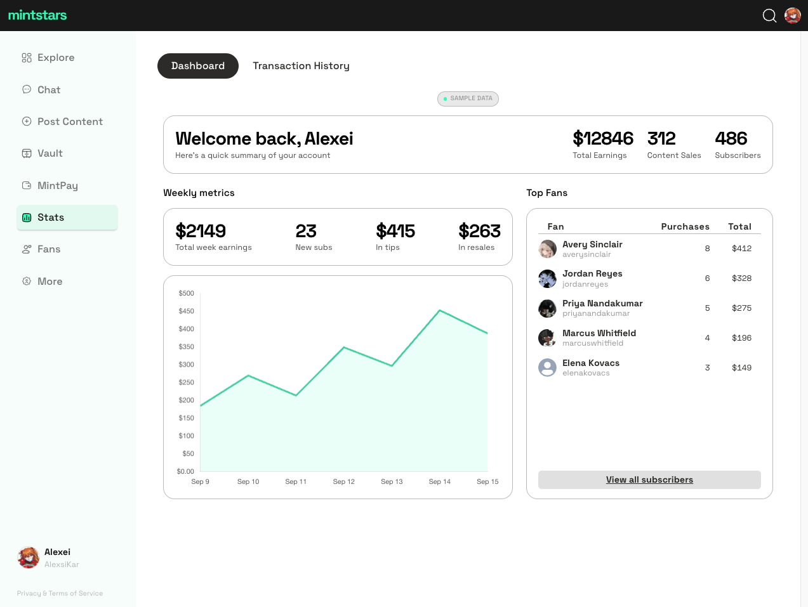
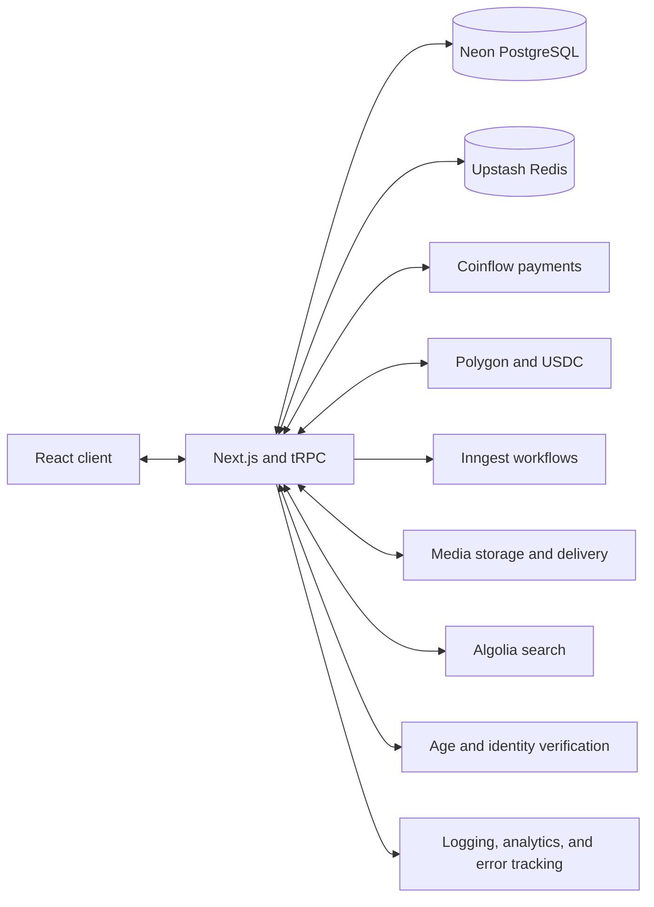
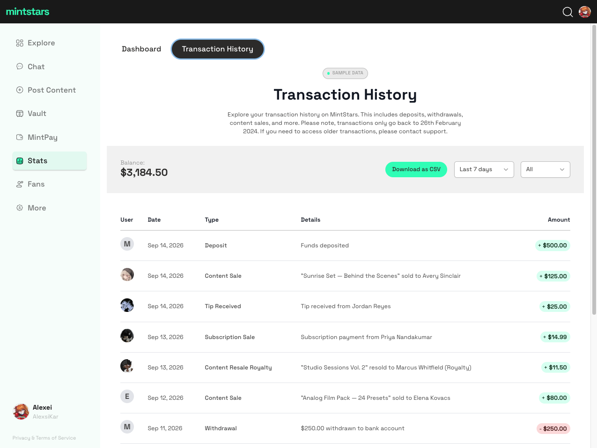
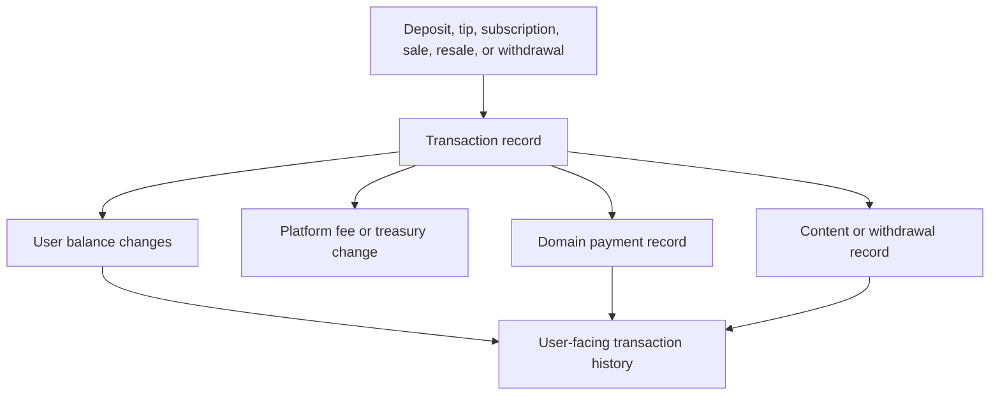
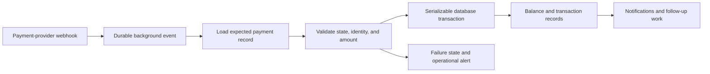
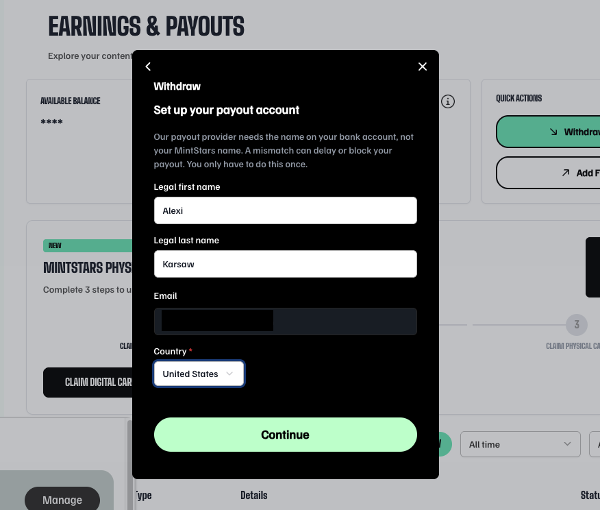
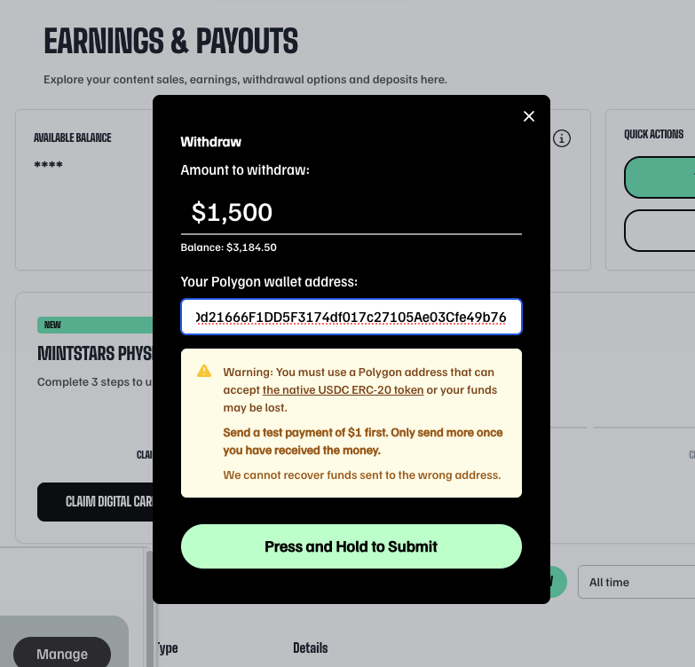
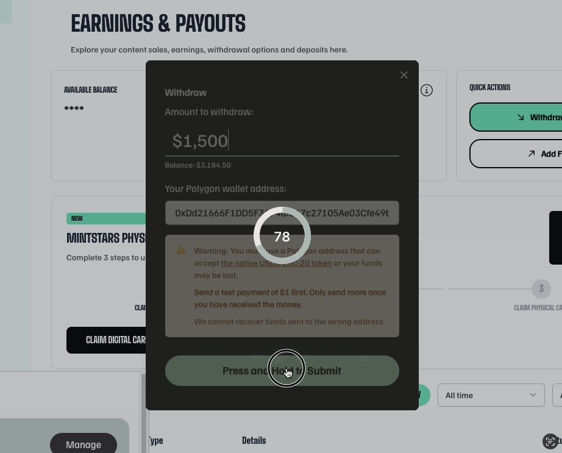

# MintStars

### Creator subscriptions and financial infrastructure

**Full-stack Product Engineer**

MintStars was a subscription and commerce platform for independent adult creators. It combined publishing, recurring subscriptions, direct content sales, tips, internal balances, and creator payouts in one product.

I led a ground-up application rewrite and built across the product stack, with particular responsibility for the financial systems connecting payments, balances, transaction history, and fiat and USDC withdrawals. During this period, the platform grew roughly **12× in creators and 10× in monthly revenue**.

The case study stays focused on the engineering and uses only work-safe product imagery.

## Rebuilding a platform while it was growing

The rewrite moved the product onto a full-stack TypeScript architecture built around Next.js, tRPC, Prisma, and PostgreSQL. It had to support a broad application surface without losing the operational details that mattered to a payments business.

_Simplified system map based on the application and its historical architecture documentation._

The surrounding platform included image and video delivery, search, authentication, age and identity verification, analytics, and operational monitoring. The harder boundary was financial: several kinds of purchases could originate from an internal balance, an external payment processor, or a combination of the two, then produce creator earnings, platform fees, and later withdrawals through a different rail.

## A unified history of money movement

I built an atomically enforced transaction and movement ledger that connected each high-level business event to the balance, treasury, and asset changes it produced. Deposits, tips, subscriptions, content sales, resales, royalties, withdrawals, and administrative adjustments could share one transaction history while retaining their domain-specific records.

Every balance or asset movement had to be accompanied by its originating transaction and required audit records in the same database transaction. Related domain records, user balance movements, platform fees, and ownership changes committed together or rolled back as a unit.

The model provided strong consistency, provenance, and auditability without attempting to serve as a full double-entry general ledger. It did not represent every source and destination through a complete chart of accounts; instead, a shared transaction identifier made each application-level movement traceable to the payment, sale, tip, subscription, withdrawal, or asset transfer that caused it.

The product-facing history then resolved those relationships into useful language, with filters for date and direction and CSV export for creators.

## Processing external payments safely

Payment-provider webhooks were turned into application state through background jobs rather than trusted as blind balance updates. The handlers checked the referenced domain record, current status, wallet, processor identifier, and expected amount before changing balances.

For the principal flows, related writes were grouped in serializable database transactions. A successful deposit, for example, updated the user balance, completed the deposit, and created its linked transaction and balance-change records together. Retry handling covered transaction conflicts, while status checks and provider identifiers protected against processing the same event twice.

The same event-driven layer handled subscription renewals and failures, tip processing, payout confirmation, transactional email, media jobs, search indexing, and recovery operations. Sentry, structured logging, and Slack alerts gave payment failures somewhere explicit to land.

## Payouts across bank and crypto rails

Creators could withdraw through conventional payout methods or receive native USDC on Polygon. The interface made the differences between those rails explicit rather than hiding them behind one generic form.

  
  

Bank payouts required a one-time account setup with the legal identity expected by the payout provider. Crypto withdrawals required a Polygon-compatible address, warned specifically about the native USDC token, and recommended a small test transfer before committing more funds.

The final crypto confirmation deliberately used friction: the creator had to press and hold while the control visibly progressed, making an irreversible action harder to trigger accidentally.

Behind that interaction, the application created a withdrawal record, submitted the USDC transfer, waited for chain confirmations through a retryable Inngest workflow, and then recorded the withdrawal transaction and user balance change together. Operational paths existed to investigate failures, mark outcomes manually when necessary, and speed up or resubmit a stuck Polygon transaction.

## Creator analytics from financial events

The creator dashboard aggregated subscriptions, tips, direct sales, and resales into a seven-day earnings view, alongside total earnings, sales, subscriber count, and top customers. Missing days were filled explicitly so the chart retained a stable time scale even during quiet periods.

The dashboard and transaction-history screenshots use representative sample data rendered through a development-only fixture mode. The presentation and data shapes come from the original application; the people, values, and content titles are synthetic.

## Selected engineering problems

- **Mixed payment sources.** Reconcile purchases funded by internal balance, external payment processing, or both without obscuring the final creator and platform amounts.
- **Webhook idempotency.** Prevent a repeated provider event from becoming a repeated balance change.
- **Atomic financial writes.** Keep the domain event, balances, fees, and transaction history aligned across related database updates.
- **Irreversible payout UX.** Add appropriate friction and network-specific guidance without making withdrawals confusing.
- **Operational recovery.** Make failed or delayed payment and blockchain operations visible and recoverable instead of silently leaving them between states.
- **Unified reporting.** Present subscriptions, tips, sales, royalties, deposits, and withdrawals through a coherent creator-facing history.

## Stack

TypeScript · React · Next.js · tRPC · Prisma · PostgreSQL · Inngest · Coinflow · ethers · Polygon · USDC · Redis · Algolia · Sentry · Axiom

## About this case study

MintStars' source code and production data are private; no company source code is included here. The first two screenshots recreate the repo-era interface with clearly marked sample data. The withdrawal screenshots show live versions of flows I built; visual design may have evolved since my tenure.

The architecture diagrams are intentionally simplified. They describe the responsibilities and system boundaries relevant to my work rather than every production integration or an exact deployment topology.

---

[Back to profile](../README.md)
