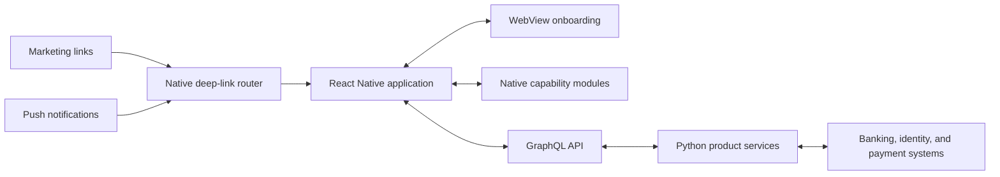
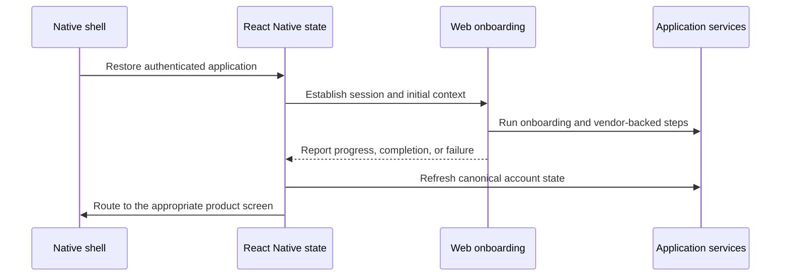
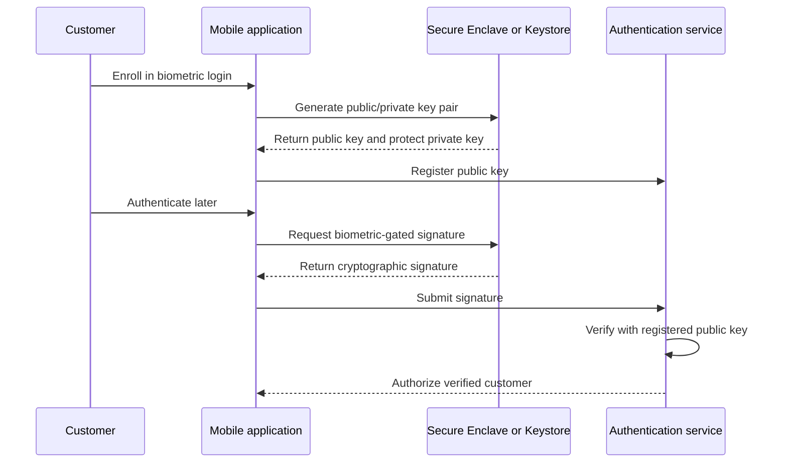

# Self Financial

### Rebuilding a consumer-fintech mobile application

**Software Engineer · 2019–2022**

Self Financial offers long-running credit-building products whose mobile experience has to make payments, balances, account status, and sensitive personal information understandable without weakening the controls around them.

I joined when the company had roughly 30 employees and worked there through a period of growth to more than 300. On a three-engineer mobile team, I helped replace separate Kotlin and Objective-C applications with a new React Native product, built core customer flows, and contributed across the GraphQL and Python services behind them.

During my tenure, the flagship application passed **one million downloads** and held a **4.9-star rating**.

## Replacing two native applications at once

The mobile rewrite began in a fresh codebase and shipped as a replacement release rather than a gradual migration. At the same time, we worked with an outside design agency on a full visual redesign.

That made the project more than a framework change. The new application had to reproduce the behavior of two mature products, preserve access to existing accounts, and introduce a consistent experience across iOS and Android. Financial workflows also carried a different cost of failure from ordinary application screens: stale state, a lost session, or an ambiguous payment status could prevent a customer from managing an active loan or secured card.

_Simplified view of the mobile architecture and the boundaries most relevant to my work._

React Native gave us one product codebase, but we treated it as the coordinating application layer rather than insisting that every problem be solved in JavaScript. Security-sensitive, performance-sensitive, and deeply platform-specific behavior remained native where that produced a safer or more reliable result.

## Onboarding across a WebView boundary

Onboarding remained a web experience embedded inside the application. A dedicated web team continually tested and refined that funnel, and its complex identity and third-party integrations were not straightforward to reproduce in React Native. Reusing it allowed the same acquisition flow to serve both web and mobile customers.

The difficult part was making an isolated browser context behave like part of one authenticated application. We had to establish the customer session inside the WebView, pass the necessary application state into it, receive progress and completion state back, and then reconcile that result with the surrounding native navigation.

The React Native bridge at the time was asynchronous, while cookies, redirects, application lifecycle changes, and WebView readiness could all advance independently. Timing and ordering failures could leave onboarding waiting on state that existed on the other side of the boundary. Much of the work was therefore not visual; it was establishing a dependable session handoff and message protocol between three stateful environments:

Deep links added another entry path into that state machine. Marketing campaigns and push notifications needed to do more than open the application: they had to restore or establish the correct session, preserve the intended destination, and route customers into onboarding, payments, notifications, or a specific account state.

## Native modules for security and performance

Several important requirements exceeded what the React Native ecosystem provided reliably at the time. I built several native integrations in Objective-C, Swift, and Java behind a consistent TypeScript-facing interface, and maintained the team's custom biometric library after its initial authorship.

| Boundary | Why it was native |
| --- | --- |
| Biometric authentication | Authentication needed a cryptographic proof created with a platform-protected device key, not a client-provided boolean saying that biometrics had passed. |
| Secure local storage | Tokens and sensitive application state belonged in iOS Keychain and Android Keystore rather than plaintext asynchronous storage. |
| App-state masking | Financial information had to disappear immediately when the application entered the background or appeared in the system app switcher. |
| Deep links and push routing | Platform entry points had to resolve reliably into the correct React Native navigation and account state. |
| Interactive charts | Passing continuous touch coordinates across the bridge to update JavaScript-rendered SVGs did not provide acceptable interaction performance. |
| Date controls | Large date ranges and product-specific behavior performed poorly in JavaScript, while the available Android component was not sufficiently stable or visually consistent. |

### Cryptographic biometric authentication

The biometric library used public-key cryptography rather than treating a successful Face ID or fingerprint prompt as sufficient proof on its own.

The private key remained protected on the device. A successful biometric prompt unlocked its use to create a cryptographic signature, and the server verified that signature using the registered public key before authorizing the customer. This moved the security decision away from a spoofable client response and into a server-verifiable protocol.

## Owning customer-facing financial flows

I owned or made substantial contributions to flows across both the Credit Builder Account and secured credit card, including:

- Autopay management for both products
- Plaid account linking
- Profile, settings, and payment-method management
- Live customer support
- Deep-link and push-notification destinations
- Product status, payment, and account-history interfaces

The live-chat integration also crossed application boundaries. On the web, a third-party widget lived globally in an iframe and needed to carry the appropriate identity and conversation state as a customer moved between logged-out and authenticated experiences.

My work was not limited to the clients. The core credit-builder and secured-card systems were mature Python services with complex state around loan maturation, payments, notifications, monitoring, and credit reporting. I made targeted changes there, exposed new product state through GraphQL, and followed full-stack defects across the client, API, and underlying service when the boundary itself was the problem.

## Coordinating platform and mobile releases

Non-junior engineers rotated through release management for the company's biweekly platform release. As release manager, I worked across the engineering department to collect and tag the included work, coordinate staging builds and peer QA, follow up on fixes and retesting, and deploy every changed backend service, the GraphQL server, and the web application to production. Many parts of that process were driven by scripts the release manager ran directly.

Mobile followed a separate cadence. Because each release also involved App Store or Play Store review, the small mobile team shipped ad hoc when a meaningful set of changes was ready rather than treating the application as part of the biweekly platform train. We generally owned our own QA and distributed TestFlight builds for validation. For larger changes, we recruited engineers from other teams to help work through full manual regression testing before submission.

The core backend systems had thorough unit and integration coverage, while client regression testing initially depended more heavily on extensive manual checklists. A pull-request reviewer commonly served as the feature's QA owner. During my final year, the company hired a QA automation engineer and began automating more of that regression surface.

Both release models made operational quality a shared engineering responsibility. Building a feature also meant making it testable, helping validate adjacent changes, and being available when a coordinated platform release or mobile submission exposed an interaction that no individual ticket captured.

## Selected engineering lessons

- **Cross-platform does not mean native-free.** A shared product layer was most effective when the team maintained clear escape hatches for platform security, performance, and lifecycle behavior.
- **A WebView integration is a distributed state problem.** Authentication, readiness, navigation, and product state need an explicit protocol even when every component runs on one phone.
- **Biometrics should unlock a credential, not become the credential.** Server-verifiable signatures provided a materially stronger authentication boundary than trusting a local success flag.
- **Financial UX includes inactive and historical states.** Mature loans, closed cards, payment histories, and unavailable actions require as much product care as acquisition flows.
- **Release work is engineering work.** Shared ownership of builds, regression testing, hotfixes, and production rollout kept a rapidly growing team close to the operational consequences of its changes.

## Stack

React Native · React · TypeScript · GraphQL · Python · Objective-C · Swift · Java · iOS Keychain · Android Keystore · PostgreSQL

## About this case study

Self Financial's source code and internal documentation are private; no company code is included here. The diagrams intentionally describe only the system boundaries relevant to my work, not Self's complete architecture or current implementation.

The product has continued to evolve since my tenure. Current application screens are therefore not presented as exact representations of the interface I shipped.

---

[Back to profile](../README.md)
