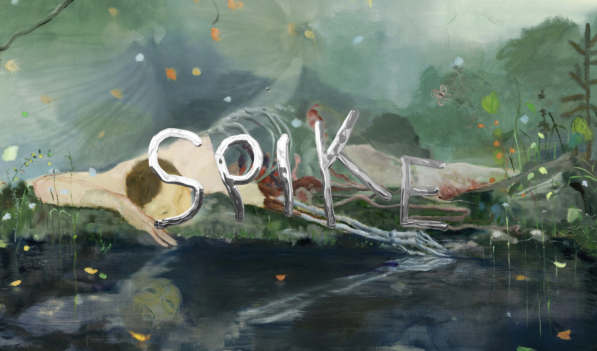
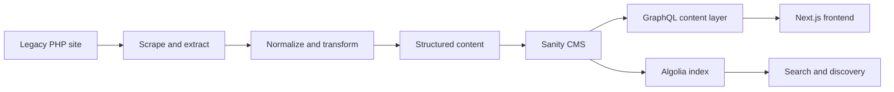
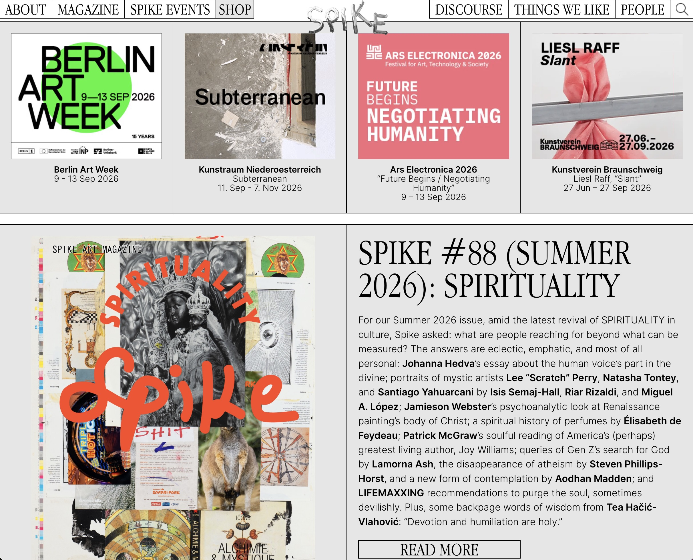
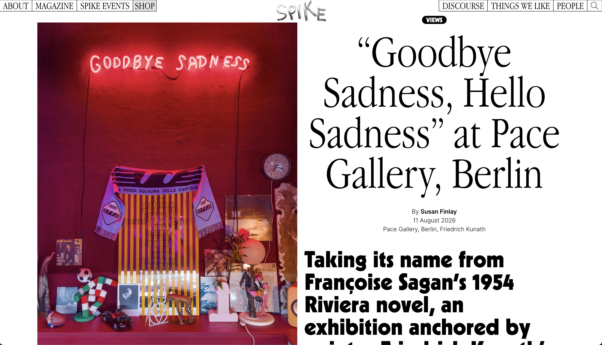
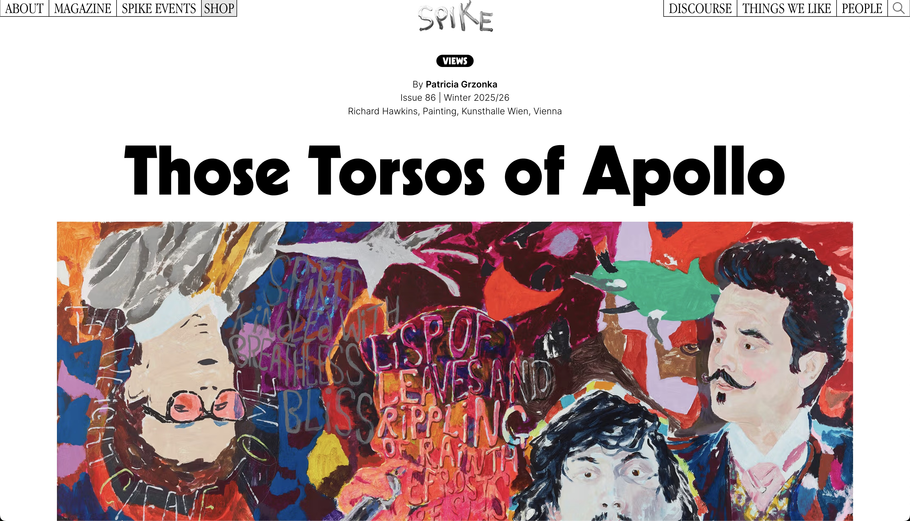
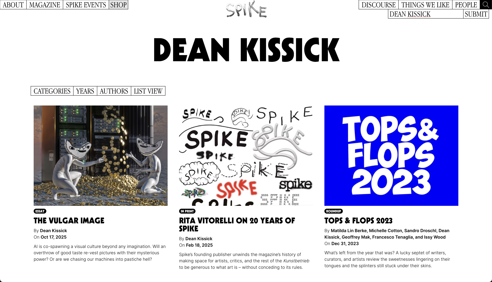
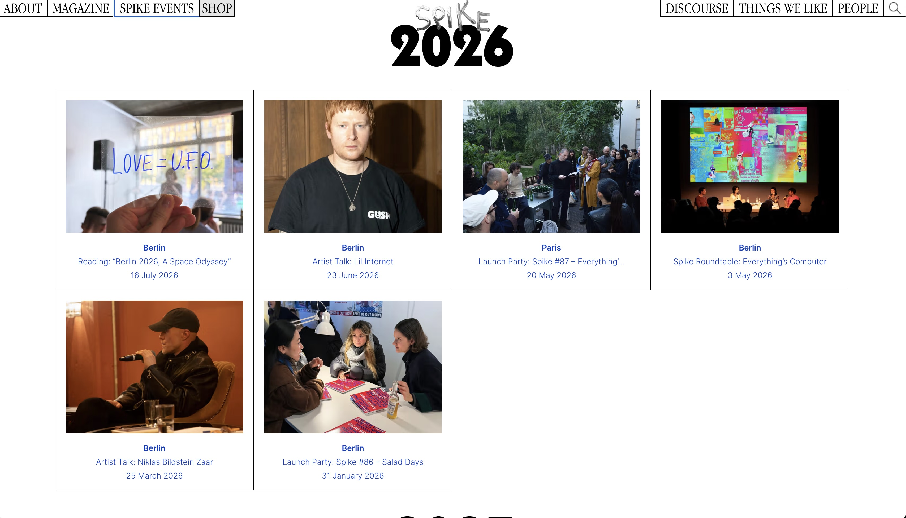
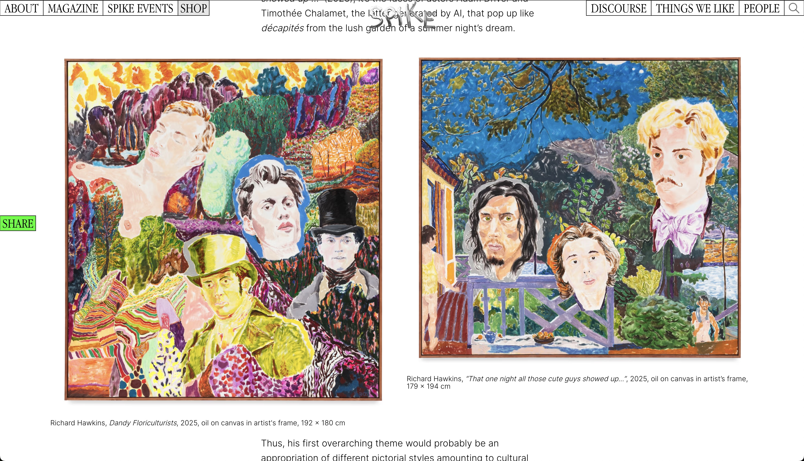
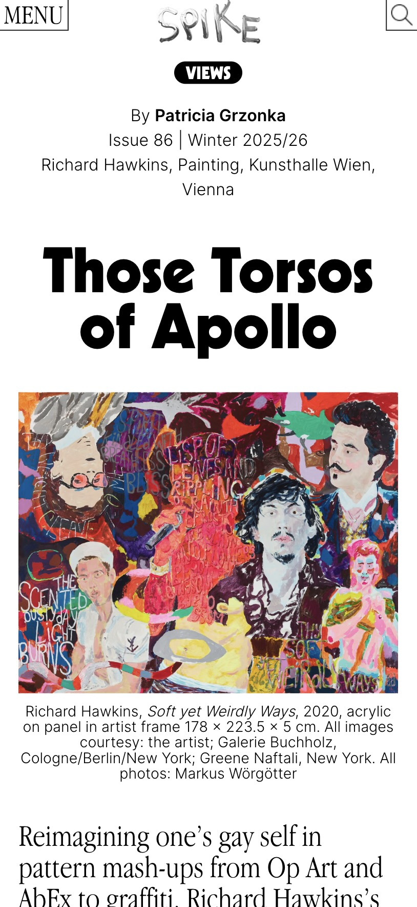

# Spike Art Magazine

### Publishing platform for an independent contemporary art magazine

**Freelance Software Engineer**

[View the live site](https://www.spikeartmagazine.com/)

Spike is an independent contemporary art magazine and publishing platform with a highly distinctive visual identity.

I rebuilt its website and publishing infrastructure, replacing a failing legacy PHP system with a modern **Next.js application and custom Sanity CMS**. My role covered engineering the public site, content architecture, legacy archive migration, search infrastructure, and the publishing system used by the editorial team.

_Web design and visual identity by Bureau Borsche._

## Rebuilding the platform

The project was both a product rebuild and a content migration. I wrote tooling to extract the existing archive from the legacy site, transform it into a new structured content model, and migrate it into Sanity. The new platform connected that editorial system to a Next.js frontend through GraphQL, with Algolia supporting search and discovery.

_Conceptual migration and publishing flow._

## Structure beneath visual specificity

Spike's visual identity deliberately resists the uniformity of a conventional publishing site. Articles, magazine issues, events, archive pages, and editorial features can have substantially different compositions while still belonging to the same publication.

The engineering challenge was to preserve that specificity without building every page as a one-off. The frontend and content architecture supported:

- distinct image and typography treatments
- multiple article and feature formats
- longform editorial content
- magazine issues and events
- author, category, and archive relationships
- responsive layouts that retained the character of the desktop design

These two article openings demonstrate the range: both are structured editorial content, but their visual hierarchy and composition are intentionally different.

  
  

## Migrating the archive

The existing publication archive could not be discarded with the legacy platform. I built migration tooling to scrape the old site, extract its editorial material, normalize inconsistent legacy content, and transform it for the new structured model in Sanity.

That work allowed the redesign to launch on a maintainable foundation without severing the magazine's history. The details here stay intentionally high-level because the source system, migration code, and production content model are private.

## Search and discovery

I integrated Algolia to make the migrated archive fast to search and navigate. The experience connects free-text search with the publication's broader discovery paths without exposing readers to the complexity of the underlying archive.

## Beyond articles

The platform also supports structured content beyond individual articles, including events, magazine issues, authors, categories, and archive relationships. These content types needed their own presentation while remaining connected to one editorial and publishing system.

## Responsive editorial design

Mobile was not desktop made narrow. Layout, hierarchy, typography, metadata, captions, and media had to recompose into a coherent reading experience while preserving the site's character.

  
  

## Stack

TypeScript · React · Next.js · Sanity · GraphQL · Algolia · Vercel

## Attribution and source

Web design and visual identity were created by Bureau Borsche. I was responsible for the engineering, implementation, platform architecture, migration, and supporting infrastructure described above.

The production source code is private. This case study contains public screenshots and technical documentation, not proprietary source code.

---

[Back to profile](../README.md)
