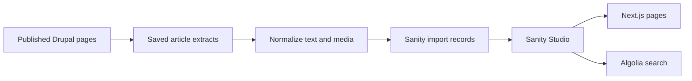

# Spike Art Magazine

### Rebuilding an editorial archive for a new publishing platform

**Role:** Freelance Software Engineer

**Dates:** March–November 2023, with occasional support through late 2024

**Scope:** Archive migration and search ownership; shared frontend and Sanity Studio implementation

[View the live site](https://www.spikeartmagazine.com/)

Spike is an independent contemporary art magazine with a glossy print edition and an international readership. It is also a publication I care about personally: my friends read it, and many write for it. Preserving its archive and helping it continue publishing made this a particularly meaningful project.

Bradley Griffith and I rebuilt its legacy Drupal website as a Next.js application with **Sanity Studio and a custom content model**, implementing **Bureau Borsche’s** redesign. Bradley established the base project and patterns from a publishing-site template he had developed for previous clients. I owned all of the archive scraping and transformation and the Algolia integration; we shared the work of building layouts, article templates, and Studio features.

My archive migration used the published website as the extraction source: I scraped articles, transformed their text and media into structured Sanity content, and helped carry legacy links into the replacement platform.

_Screenshots show later public-site content, including 2025–2026 articles; they are not launch captures. Web design and visual identity by Bureau Borsche._

## Recovering the archive through the published site

The Drupal installation was difficult to operate and recover, and its database was too large to work with on my laptop. Understanding the legacy data model well enough to extract the archive directly was another obstacle. I chose to reconstruct the articles from their published pages.

I wrote a staged migration: crawl the article index, scrape individual pages, then normalize the extracted content into Sanity import records. That separated extraction from transformation, so the saved material could be cleaned up without repeating every request to the old site.

The difficult part was converting years of inconsistent markup into editable content. The tooling resolved author and magazine-issue references, converted HTML into Sanity text blocks and pull quotes, checked image availability, and reconstructed media placement inside article bodies. Follow-up scripts populated introductions and metadata. Image checks and error logging helped identify exceptions; irregular markup still required cleanup.

_The published archive became structured material that editors could continue working with in the new platform._

Legacy links also needed a route forward. The replacement site handles old query-string URLs and contributor and subject paths, directing readers to new article and author routes or search. Where an article slug cannot be resolved, search provides a recovery path.

## Editorial flexibility within a shared model

The publishing system supports distinct article openings, media groups, pull quotes, events, and magazine issues. Editors can select presentation options while keeping authors, categories, and publication details structured.

One content-model detail I changed was separating the article's online publication date from its relationship to a print issue. An article can belong to a magazine issue while still needing its own web date for sorting and display. I made that date consistently available and required in Studio.

The frontend uses both GraphQL and Sanity's GROQ query language. Article loading uses GROQ to resolve references embedded in the body, including advertising content, alongside the article's text and media.

  
  

_The same article opening at desktop and mobile widths: typography, metadata, and imagery recompose around the viewport._

## Search and page delivery

I integrated Algolia with an initial archive import and a Sanity webhook handler for subsequent article changes. The index includes headlines, introductions, authors, tags, and publication metadata, supporting keyword search and the archive's discovery controls.

The Next.js application generates article pages statically, with on-demand generation for new paths and periodic regeneration for editorial updates. This lets the platform serve generated pages while keeping publishing in Sanity. Updates can appear after regeneration rather than immediately on every request.

The rebuild moved the archive into an editable publishing system with independent search and page delivery. The new site no longer depends on the legacy Drupal installation to publish and serve those articles.

## Stack and attribution

JavaScript · React · Next.js · Sanity · GraphQL / GROQ · Algolia · Vercel · Python migration tooling

Web design and visual identity by Bureau Borsche. Engineering by Bradley Griffith and David Yoakum.

The production source is private. This case study summarizes implementation decisions and uses public-site screenshots.

---

[Back to profile](../README.md)
